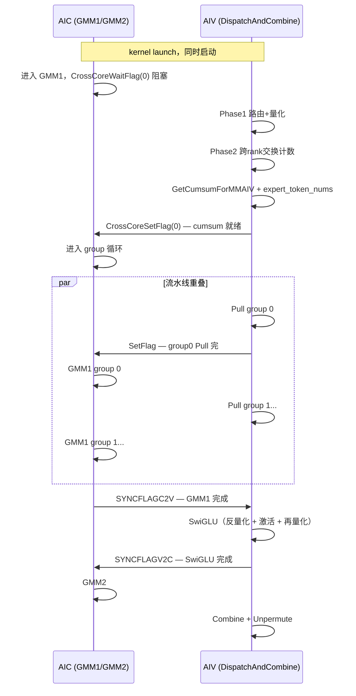

# dispatch_ffn_combine_kernel 算子解析报告

## 1. 算子整体作用

`dispatch_ffn_combine_kernel` 是一个面向 MoE Expert Parallel 场景的融合算子。它把 MoE 推理或训练中的三个典型阶段放进同一个 Ascend C kernel：

- **Dispatch**：根据 `expert_idx` / `expertId` 把输入 token 路由到对应 expert。跨 rank 的 Expert Parallel 场景下，一个 token 可能需要发给远端 rank 上的 expert。本实现先做本地 routing / sorting / dynamic quant，然后通过 HCCL window / peermem 访问完成 rank 间 token 搬运。
- **FFN**：每个 expert 对接收到的 token 执行两层 FFN。这里主要是 `x * w1 -> SwiGLU -> * w2`。AIC/Cube 负责两次 GEMM：`GMM1` 和 `GMM2`，AIV/Vector 负责 SwiGLU、量化/反量化和搬运。
- **Combine**：把各 expert 计算后的 token 结果按照原始 token/topK 关系合并回去。跨 rank 场景下，结果需要写回目标 rank 的 peermem，再由本 rank unpermute 到最终输出 `out`。

该 kernel 把 dispatch、ffn、combine 融合在一起，主要是为了减少传统分阶段 MoE pipeline 的额外开销：

- 减少中间 tensor 落 GM 的次数，例如 dispatch 后的 permuted token、FFN 中间结果、combine 前结果不必在多个独立算子之间反复写出/读入。
- 减少多 kernel launch 和 host 调度开销。
- 减少独立 all-to-all / reorder / GEMM / combine 算子之间的全局同步。
- 让 AIV 的通信搬运、routing、epilogue 与 AIC 的 GEMM 形成生产者-消费者流水。
- 利用 workspace 和 peermem 的固定布局复用中间 buffer，避免普通 pipeline 中多份临时 buffer。

从代码看，这个算子是一个 **MC2 通信 + 计算融合**算子：`dispatch_ffn_combine_def.cpp` 中为算子注册了 `.MC2().HcclGroup("group")`，host tiling 中配置了 `AlltoAll=level0:fullmesh;level1:pairwise`，device 端通过 `HcclShmem` 访问本 rank 和远端 rank 的 window。

## 2. 输入输出与核心数据结构

### 2.6 token、expert、rank、group、block、core 的关系

- **token**：原始输入 `x` 的一行。每个 token 有 `topK` 个 expert 目标。
- **expert**：被切分到不同 rank。总 expert 数约为 `EP * expertPerRank`。
- **rank / EP**：Expert Parallel 通信域中的设备编号。`EP` 在 device 侧表示 world size。
- **groupIdx**：本 rank 内 expert 编号，范围 `[0, expertPerRank)`。AIC 的 GMM1/GMM2 都按 `groupIdx` 分组计算。
- **dstEpIdx**：代码中经常表示目标/远端 rank 编号，范围 `[0, EP)`。
- **block**：GEMM tile 调度单位。`L1TileShape = GemmShape<128, 256, 512>`，即 GEMM 逻辑 tile 的 M/N/K 分块。
- **AIC core**：执行 Cube/GEMM。
- **AIV core / subblock**：执行 routing、copy、scale、SwiGLU、combine、unpermute 等 vector / MTE 操作。AIV 侧 `coreIdx = get_block_idx() + get_subblockid() * get_block_num()`，见 `dispatch_ffn_combine_kernel.hpp` 第 196-198 行。

### 2.7 关键变量语义

- `expandedRowIdx`：InitRouting 生成的 expanded token 到原 token/topK 关系的索引。最后 `KernelMoeTokenUnpermute` 用它从 peermem `offsetD` 读回结果并按 `probs` 加权写 `out`。见第 806-811 行和第 998-1002 行。
- `perTokenScale` / `gmPerTokenScale1`：dynamic quant 后每个 dispatched token 的量化 scale。GMM1 输出 `gmC` 在 `BlockEpilogue1` 中乘它做反量化，见 `block_epilogue_pertoken_swiglu.hpp` 第 213-220 行。
- `gmPerTokenScale2`：SwiGLU 后再量化产生的 scale。GMM2 输出 `gmC2` 在 CombineV1/V2 中乘它反量化，见 `block_epilogue_pertoken_v2.hpp` 第 159-179 行。
- `tokenPerExpert`：三维逻辑布局，`tokenPerExpertLayout(dstEpIdx, rank, groupIdx)` 表示“来自/面向某 rank 与本 rank、某 expert 组之间”的 token 数。具体 dim0/dim1 含义在不同阶段的读写方向中容易混淆；结合 `Pull` 和 `Combine` 代码推断，它保存每个 rank 对每个目标 rank、每个 expert 的 token 数矩阵。
- `cumsumMM`：按 rank 维对 `tokenPerExpert` 做前缀和，`cumsumMM((EP - 1) * expertPerRank + groupIdx)` 是本 rank 的某 expert group 收到的总 token 数，供 GMM 的 M 维使用。
- `preSumBeforeRank` / `sumBeforeRank`：combine 写回目标 rank peermem 时的目标行偏移。`preSumBeforeRank(dstEpIdx * expertPerRank + groupIdx)` 表示当前 rank 写回 `dstEpIdx` 的该 expert 组结果时，在目标 peermem 中应该写到该 expert 分段内的起始行。该语义来自 `CrossRankSyncAndlocalTokenPerExpertAllGatherAndGetSumPreRankV2` 第 710-724 行和 CombineV1/V2 使用处。
- `preSrcExpertSum`：CombineV2 中当前 expert group 在本地 `gmC2` 中的起始行累计偏移，见第 1057、1105 行。
- `prevGroupSum1` / `prevGroupSum2`：Dispatch Pull / CombineV1 中前面 expert group 的累计行数，用于拼接 workspace 中按 expert group 排列的 token。
- `epilogueGranularity`：把 GMM1/SwiGLU 切成两波的 group 粒度，在 `dispatch_ffn_combine.h` 第 264-268 行设置为 `expertPerRank - 3` 或小 expert 数时 `expertPerRank - 1`。

AIC 主要消费：

- `gmA`：AIV 从 peermem pull 到本地 workspace 的 dispatched token。
- `ptrB1/ptrB2`：expert 权重。
- `ptrScale1/ptrScale2`：GEMM scale。
- `gmPermutedToken`：SwiGLU 后、GMM2 前的 int8 中间结果。

AIV 主要消费/产生：

- 消费 `x`、`expertIdx`、`probs`、`xActiveMask`。
- 产生 `expandedRowIdx`、`tokenPerExpert`、`cumsumMM`、`preSumBeforeRank`。
- 搬运 peermem `offsetA` 到 workspace `gmA`。
- 对 `gmC` 做 SwiGLU 和量化，产生 `gmPermutedToken`、`gmPerTokenScale2`。
- 对 `gmC2` 做反量化并 scatter 到远端 peermem `offsetD`。
- 最后 unpermute 到 `out`。

## 3. 顶层执行流程

### 阶段 0：Host / kernel 入口与关键初始化

**目标**：根据 tiling 选择 kernel 类型，构造 device 侧类型和参数。

**参与者**：Host tiling、kernel 入口、AIC/AIV 混合任务。

**关键代码**：

- `op_kernel/dispatch_ffn_combine.cpp` 第 22-32 行。
- `op_kernel/dispatch_ffn_combine.h` 第 170-286 行。
- `dispatch_ffn_combine_kernel.hpp` 第 189-253 行。

**输入**：`x/w1/w2/expertId/scale1/scale2/probs/xActiveMask/out/expertTokenNums/workspaceGM/tilingGM`。

**输出**：构造 `DispatchFFNCombineKernel::Params`，初始化 workspace tensor 与 peermem 布局。

**说明**：

`DispatchFFNCombine::Process` 选择 `Arch::AtlasA2`、`BlockMmad`、三个 `BlockEpilogue` 和 `BlockScheduler`。`DispatchFFNCombineKernel` 构造时区分 AIC/AIV 获取 `coreIdx/coreNum`，并在 `initBuffer` 中设置 `gmA/gmC/gmC2/gmPermutedToken/gmPerTokenScale1/gmPerTokenScale2/tokenPerExpert/cumsumMM/preSumBeforeRank`。

`operator()<AIC>` 调用 `GMM1`，等待 `SYNCFLAGV2C`，再调用 `GMM2`；`operator()<AIV>` 调用 `DispatchAndCombine`。见 `dispatch_ffn_combine_kernel.hpp` 第 213-228 行。

### 阶段 1：ApplyXActiveMask(AIV)

**目标**：如果提供了 `xActiveMask`，让 inactive token 不参与 routing。

**参与者**：AIV、GM、UB。

**关键代码**：`ApplyXActiveMask`，`dispatch_ffn_combine_kernel.hpp` 第 357-396 行。

**输入**：`expertIdx`、`xActiveMask`。

**输出**：被 mask 的 token 对应 expert id 改为 sentinel `expertNum`。

**为什么这样做**：

后续 `moe_init_routing_quant_v2` 会按 expert id routing。把 inactive token 的 expert id 改成 `expertNum`，相当于让它们落到无效 expert 或跳过路径。这里的具体 sentinel 处理逻辑依赖 `moe_init_routing_quant_v2`，需要进一步确认。

### 阶段 2：InitRouting + dynamic quant

**目标**：根据 `expertIdx` 对 token 做**路由、排序/展开**，并量化 token，写入 peermem。

**参与者**：AIV、GM、workspace、peermem。

**为什么这样做**：

后续 GEMM 使用 int8 `AType`，因此 routing 时顺便 dynamic quant，把 token 和 scale 组织成适合 all-to-all / pull 的 peermem 布局。排序是为了保证数据的连续性，从而保障GEMM的性能

### 阶段 3：跨 rank token count 交换与 cumsum

**目标**：让每个 rank 知道每个远端 rank、每个 expert group 有多少 token，并计算本地 GEMM 需要的 M 维和 combine 写回偏移。
1. 将本卡统计的本地 Token 计数加上标记（fence用），直接推送到其他所有 Rank 的 Peer Memory
2. 等待写操作完成
3. 等待其他rank推送过来的数据到达，减去魔数恢复真实 token count；
   + 需要保证所有rank的token count都到达，才能开始后续的GMM1、SwiGLU、GMM2 
4. 根据收齐后的 tokenPerExpert 计算当前 rank 对应 expert 的 preSumBeforeRank（前缀和），为后续 dispatch、GEMM 和 combine 阶段提供 M 维偏移。


**参与者**：AIV、peermem、workspace、rank 间同步。

**关键代码**：

- `CrossRankSyncAndlocalTokenPerExpertAllGatherAndGetSumPreRankV2` 第 652-728 行。
- `GetCumsumForMMAIV` 第 399-429 行。
- `DispatchAndCombine` 第 815-840 行。

**输入**：local `tokenPerExpert`。

**输出**：

- 全 rank 可见的 `tokenPerExpert` 矩阵。
- `preSumBeforeRank`：combine 目标 offset。
- `cumsumMM`：GMM 分组 M 维。
- `expert_token_nums`：本 rank 每个 expert 的总 token 数。

**为什么这样做**：

GEMM 以本地 expert group 为单位做批处理，需要知道每个 group 总共有多少 token；combine 写回远端 peermem 时，需要知道这些 token 在目标 rank 的 expert 分段里应该写到哪里。

### 阶段 4：AIV 按 expert group 从远端 peermem Pull token（DISPATCH）

**目标**：把各 rank 发往本 rank expert 的量化 token 拉到本地 workspace `gmA`，并拉取 per-token scale 到 `gmPerTokenScale1`。
1. 逐个遍历本地的expert
2. 对每个expert收到的token拉取，所有AIV的core分摊去拉取EP个rank的数据
3. 最后每个core单独等待该expert组的所有rank的token拉取完成，就可以通知AIC开始GMM1，不需要等待其他core

**参与者**：AIV、peermem、GM workspace、UB、MTE。

**关键代码**：

- `DispatchAndCombine` 第 851-909 行。
- `CopyGMToGMPerToken` 第 310-352 行。

**输入**：

- 远端 peermem `offsetA`
- `tokenPerExpert`
- `cumsumMM`
- `preSumBeforeRank`

**输出**：

- 本地 workspace `gmA`
- 本地 workspace `gmPerTokenScale1`

**为什么这样做**：

AIC 的 GEMM 需要本地连续的 `[tokens_for_expert, hidden]` 矩阵。各 rank 的 token 原本分散在远端 peermem 中，因此 AIV 多核按 `dstEpIdx` 分片拉取。每个 expert group pull 完后，通过 `CrossCoreSetFlag` 通知 AIC 可以开始该 group 的 GMM1，见第 885-888 行。

### 阶段 567：AIC GMM1  -- SWIGLU  -- AIC GMM2
时间片:        t1              t2              t3              t4

AIC:       GMM1(wave1)     GMM1(wave2)     GMM2(wave1)     GMM2(wave2)
                │               │               │               │
                │               │               │               │
AIV:            idle        SwiGLU(wave1)   SwiGLU(wave2)      idle/finish


### 阶段 8：CombineV1 / CombineV2 写回 peermem

**目标**：把 GMM2 输出按 rank/expert/token 布局写回目标 rank 的 peermem `offsetD`。
1. 注意，combine的最后是有全局同步的，后同步

**参与者**：AIV、workspace `gmC2`、`gmPerTokenScale2`、peermem、BlockEpilogue2/3。

**关键代码**：

- `DispatchAndCombine` 第 977-986 行。
- `CombineV1` 第 1006-1047 行。
- `CombineV2` 第 1050-1109 行。
- `block_epilogue_pertoken_v2.hpp` 第 123-230 行。

**输入**：

- `gmC2`
- `gmPerTokenScale2`
- `tokenPerExpert`
- `preSumBeforeRank`
- `cumsumMM`

**输出**：远端 rank peermem `offsetD`。

**为什么这样做**：

GMM2 输出在本 rank 是按本地 expert group 聚合排列的，但最终每个 token 的结果应回到原始 token 所在 rank，并且还要按原 token/topK 顺序参与 unpermute。因此 combine 不能简单 memcpy，必须根据 `tokenPerExpert` 和 `preSumBeforeRank` 做分段 scatter。

### 阶段 9：CrossRankSync + Unpermute

**目标**：确保所有 rank 的 combine 写回完成，然后按 `expandedRowIdx` 和 `probs` 还原最终输出。

**参与者**：AIV、peermem、workspace、GM output。

**关键代码**：

- `ResetTokenPerExpert` 第 730-743 行。
- `shmem.CrossRankSync()` 第 992-993 行，对应 `hccl_shmem.hpp` 第 166-183 行。
- `KernelMoeTokenUnpermute` 第 998-1002 行。

**输入**：

- peermem `offsetD`
- `expandedRowIdx`
- `probs`

**输出**：`ptrOutput` / `out`。

**为什么这样做**：

combine 写回远端 peermem 是跨 rank 的；若不做 rank 间同步，本 rank 可能在远端结果尚未全部写入时开始 unpermute，导致读到旧数据或未完成数据。`expandedRowIdx` 记录了 routing 后 token 与原 token/topK 的关系，`probs` 用于 topK 加权。

## 6. 通信与计算的调度关系

### 6.2 通信发生在哪些阶段

- token count exchange 阶段：`CrossRankSyncAndlocalTokenPerExpertAllGatherAndGetSumPreRankV2` 把本 rank token count 写到远端 peermem，并等待远端写入。
- Dispatch Pull 阶段：AIV 从远端 rank peermem `offsetA` 拉取发往本 rank expert 的 token。
- Combine 阶段：AIV 把本 rank expert 计算完成的结果写回目标 rank peermem `offsetD`。
- Unpermute 前：`CrossRankSync()` 保证所有 rank combine 写回完成。

### 6.3 通信前后数据布局变化

通信前：

- `x` 是按本 rank 原始 token 顺序排列。
- `expertIdx` 表示每个 token 的目标 expert。

InitRouting 后：

- token 按 expert/rank 分组，量化后写到 peermem `offsetA`。
- `expandedRowIdx` 记录原顺序映射。
- `tokenPerExpert` 记录每个 rank/expert 的 token 数。

Dispatch Pull 后：

- 本 rank workspace `gmA` 中 token 按本地 expert group 连续排列。
- `cumsumMM` 提供每组起点/长度。

Combine 后：

- GMM2 输出从本地 expert-group layout scatter 到目标 rank peermem `offsetD`。
- peermem `offsetD` 中的数据布局适合 `KernelMoeTokenUnpermute` 根据 `expandedRowIdx` 读回。

### 6.4 是否存在通信-计算重叠

存在一定程度的重叠，尤其是 AIV Pull 与 AIC GMM1 之间。

证据：

- AIV 每完成一个 expert group 的 Pull，就 `CrossCoreSetFlag` 通知 AIC，见 `DispatchAndCombine` 第 885-888 行。
- AIC 的 `GMM1` 在每个 group 计算前等待对应 flag，见第 477-480 行。
- 这意味着 AIV 可以继续 pull 后续 group，AIC 同时计算已准备好的前面 group，形成 producer-consumer。

GMM1 和 SwiGLU / GMM2 也有流水：

- GMM1 在 `epilogueGranularity` 位置调用 `Finalize(..., SYNCFLAGC2V)`，见第 505-512 行。
- AIV 等 `SYNCFLAGC2V` 后做第一波 SwiGLU，完成后 `SetFlag(SYNCFLAGV2C)`，见第 942-956 行。
- AIC 等 `SYNCFLAGV2C` 后进入 GMM2，见第 217-219 行和第 586-588 行。

Combine 与 GMM2：

- CombineV1 会按 group 等待 AIC flag，见第 1011-1014 行。
- CombineV2 在每个 group 里等待 `CrossCoreWaitFlag`，见第 1089-1092 行。
- 说明 combine 消费 GMM2 输出，也按 group/tile 形成同步关系。

### 6.5 生产者-消费者关系

- AIV InitRouting / Pull 是 AIC GMM1 的生产者。
- AIC GMM1 是 AIV SwiGLU 的生产者。
- AIV SwiGLU 是 AIC GMM2 的生产者。
- AIC GMM2 是 AIV Combine 的生产者。
- AIV Combine 是最终 Unpermute 的生产者。

### 6.6 flag、sync、workspace、pipe、双缓冲

主要协调机制：

- `AscendC::SyncAll<true>()`：AIV/AIC 内核内全 core 同步，保护共享 workspace 或 peermem 状态。
- `CrossCoreSetFlag<0x2>` / `CrossCoreWaitFlag<0x2>`：AIC/AIV 或核间阶段同步。
- `HardEvent` flag：UB/MTE/Vector/FIX pipe 之间同步，例如 `MTE2_V`、`V_MTE3`、`MTE3_MTE2`。
- `gm_signal_wait_until_ne`：轮询远端 peermem 中的 token count 信号。
- `gm_dcci`：cache clean/invalidate，确保远端写入可见。
- UB ping-pong：`CopyGMToGM`、`CopyGMToGMPerToken`、`BlockEpilogue2/3` 都使用双 buffer 或多 event。
- `BlockMmad` preload stages：`PRELOAD_STAGES=1`、`L1_STAGES=2`、`L0A/L0B_STAGES=2`，在 `block_mmad_preload_async_fixpipe_quant.hpp` 第 190-263 行体现 GM->L1 preload 与 MMAD 交叠。

### 6.7 关键同步点

先区分本算子里常见的 **同步作用域**（由小到大）：

| 作用域 | 典型 API | 参与方 | 是否跨 rank |
|--------|----------|--------|-------------|
| **Pipe 内** | `SetFlag/WaitFlag<HardEvent>`（如 `MTE3_MTE2`） | 单个 core 上 MTE / Vector / Cube 流水线 | 否 |
| **Rank 内全 core** | `AscendC::SyncAll<true>()` | 本 NPU 上该 kernel 的所有 AIC + AIV core | 否 |
| **Rank 内 AIC↔AIV** | `CrossCoreSetFlag/WaitFlag<0x2>` | 同一 rank 上的 Cube 与 Vector | 否 |
| **跨 rank（EP）** | `gm_signal_wait_until_ne`、peermem Push/Pull、`shmem.CrossRankSync()` | 所有 EP rank | 是 |

**注意**：`SyncAll` 只保证 **本 rank 内** 可见性；**不会**等待其他 rank。跨 rank 协调要么靠 peermem 轮询（Phase 2 token count 交换），要么靠 `CrossRankSync()`（Combine 后 Unpermute 前）。

下面按执行顺序列出关键同步点（代码位置见第 8 节）：

| # | 同步点 | 作用域 | 保护资源 / 正确性 | 源码位置（约） |
|---|--------|--------|-------------------|----------------|
| 1 | InitRouting 后 `SyncAll` | **Rank 内全 core** | 本 rank 的 `expandedRowIdx`、local `tokenPerExpert`、peermem `offsetA`、per-token scale 写完 | `DispatchAndCombine` 922 行 |
| 2 | Phase 2 token count **Push + 轮询**（`gm_signal_wait_until_ne`） | **跨 rank** | 各 rank 写入远端 peermem 的 `tokenPerExpert`；收齐后才能还原计数、算 `preSumBeforeRank` | `CrossRankSyncAnd...` 728–731 行 |
| 3 | token count exchange 末尾 `SyncAll` | **Rank 内全 core** | 本 rank 内 `tokenPerExpert` / `preSumBeforeRank` 对所有 core 可见（**不是**全 rank 屏障） | 同上 835 行 |
| 4 | `GetCumsumForMMAIV` 后 `SyncAll` | **Rank 内全 core** | `cumsumMM`（core 0 写入）对其他 core 及后续 Pull/GMM 可见 | `DispatchAndCombine` 943 行 |
| 5 | cumsum 就绪 `CrossCoreSetFlag(0)` / GMM1 `WaitFlag(0)` | **Rank 内 AIC↔AIV** | AIC 读取 `cumsumMM` 确定每组 M 维 | AIV 956 行；AIC GMM1 486–487 行 |
| 6 | 每 group Pull 后 `SyncAll` + `CrossCoreSetFlag` | **Rank 内**：先全 AIV core，再 AIC↔AIV | 本 rank 所有 AIV 完成该 expert 组 Pull 后，AIC 才读对应 `gmA` / `gmPerTokenScale1` | AIV 1001–1004 行；AIC GMM1 524–527 行 |
| 7 | Pull 阶段结束 `WaitFlag(MTE3_MTE2)` | **Pipe 内**（单 AIV core） | UB 双缓冲上 GM→GM 搬运全部结束，再进入 SwiGLU | 1027–1028 行 |
| 8 | `SYNCFLAGC2V`（AIC Set → AIV Wait） | **Rank 内 AIC↔AIV** | AIV SwiGLU 不读未完成的 `gmC`；分两波时对应 `epilogueGranularity` | GMM1 559、581 行；AIV 1060、1077 行 |
| 9 | SwiGLU 波次间 `SyncAll` | **Rank 内全 core** | 本 rank 多 AIV core 间 SwiGLU 输出一致后再发下一波 flag | 1071、1089 行等 |
| 10 | `SYNCFLAGV2C`（AIV Set → AIC Wait） | **Rank 内 AIC↔AIV** | AIC GMM2 不读未完成的 `gmPermutedToken` / `gmPerTokenScale2` | AIV 1073、1090 行；AIC 218、636 行 |
| 11 | Combine 前 group/tile `CrossCoreWaitFlag` | **Rank 内 AIC↔AIV** | AIV Combine 不读未完成的 `gmC2`；CombineV1 按 group，CombineV2 按 tile | CombineV1 1130 行；CombineV2 1208 行 |
| 12 | Combine 后 `SyncAll` | **Rank 内全 core** | 本 rank Combine 写 peermem 的 MTE 操作在本 rank 内完成 | 1105 行 |
| 13 | `shmem.CrossRankSync()` | **跨 rank（全 EP 屏障）** | 所有 rank 的 peermem `offsetD` combine 结果对 Unpermute 可见 | 1110 行；`hccl_shmem.hpp` 166–183 行 |

**两个常见误解（Pull / Combine 边界）**：

- **Pull 全部完成后**：只有 rank 内 `SyncAll`（每组）和 Pipe `WaitFlag`，**没有** `CrossRankSync()`。各 rank Pull / SwiGLU 进度可以不一致。
- **Combine 开始之前**：**没有**全 rank 屏障；Combine 依赖本 rank GMM2 的 `CrossCoreWaitFlag`，各 rank 按本地 FFN 进度独立 scatter 到远端 peermem。
- **全 rank 屏障只出现在 Combine 之后、Unpermute 之前**（#13），因为 Unpermute 要从 **其他 rank** 的 peermem `offsetD` 读回数据。

**与第 8 节的关系**：上表是 6.7 的速查；第 8.1–8.11 节对每个同步点有更细的「去掉风险 / 性能影响」说明。


## 8. 关键同步与正确性保障

### 8.1 `AscendC::SyncAll<true>()` after InitRouting

**位置**：`DispatchAndCombine` 第 813 行。

**保护资源**：`expandedRowIdx`、local `tokenPerExpert`、peermem `offsetA`、per-token scale。

**去掉风险**：后续 token count exchange 或 pull 可能读到未完成的 routing/quant 数据。

**类型**：核内同步。

**性能影响**：会形成阶段边界，但 routing 输出是后续通信和 GEMM 的必要输入。

### 8.2 token count exchange 中的远端信号等待

**位置**：`CrossRankSyncAndlocalTokenPerExpertAllGatherAndGetSumPreRankV2` 第 652-728 行，尤其第 690-696 行 `gm_signal_wait_until_ne`。

**保护资源**：远端 rank 写入的 `tokenPerExpert`。

**去掉风险**：读取未写完或旧的 token count，导致 cumsum/GEMM M 维/combine offset 全错。

**类型**：通信同步。

**性能影响**：可能受 rank 数、window 访问延迟、负载不均影响。

### 8.3 `GetCumsumForMMAIV` 后 `SyncAll`

**位置**：`DispatchAndCombine` 第 821-832 行。

**保护资源**：`cumsumMM`、`preSumBeforeRank`。

**去掉风险**：AIC 可能基于未完成的 cumsum 计算错误 M 维；AIV pull 可能用错行偏移。

**类型**：核内同步。

**性能影响**：小，但在所有 group 计算前是硬依赖。

### 8.4 AIV Pull 完 group 后通知 AIC

**位置**：AIV 第 885-888 行；AIC GMM1 第 477-480 行。

**保护资源**：`gmA` 和 `gmPerTokenScale1` 中当前 expert group 的数据。

**去掉风险**：AIC GMM1 读取尚未从远端 peermem pull 完的 token。

**类型**：AIC-AIV 同步。

**性能影响**：这是通信-计算流水的关键。同步太粗会降低重叠，太细会增加 flag 开销。

### 8.5 `SYNCFLAGC2V`

**位置**：常量第 60 行；GMM1 `Finalize(..., SYNCFLAGC2V)` 第 505-512、528-532 行；AIV wait 第 942-944、960-961 行。

**保护资源**：`gmC`。

**去掉风险**：AIV `BlockEpilogue1` 读取未完成的 GMM1 输出。

**类型**：AIC-AIV 同步。

**性能影响**：控制 GMM1 与 SwiGLU 流水粒度。

### 8.6 `SYNCFLAGV2C`

**位置**：常量第 61 行；AIV set 第 954-956、972-973 行；AIC wait 第 217-219、586-588 行。

**保护资源**：`gmPermutedToken` 和 `gmPerTokenScale2`。

**去掉风险**：AIC GMM2 读取未完成的 SwiGLU/quant 输出。

**类型**：AIC-AIV 同步。

**性能影响**：决定 GMM2 能否尽早启动。

### 8.7 BlockMmad 内部 hard event

**位置**：`block_mmad_preload_async_fixpipe_quant.hpp` 第 190-294 行。

**保护资源**：L1/L0A/L0B/L0C、MTE/FIX/MMAD pipeline。

**去掉风险**：tile 搬运、MMAD、写回乱序导致数据覆盖或读未完成 tile。

**类型**：pipe 内同步。

**性能影响**：必要的 pipeline 正确性开销；设计目标是用 preload stages 隐藏搬运延迟。

### 8.8 BlockEpilogue 内部 hard event

**位置**：

- `block_epilogue_pertoken_swiglu.hpp` 第 203-282 行。
- `block_epilogue_pertoken_row.hpp` 第 158-187 行。
- `block_epilogue_pertoken_v2.hpp` 第 147-185、193-228 行。

**保护资源**：UB buffer、GM->UB copy、Vector 计算、UB->GM copy。

**去掉风险**：UB 被覆盖、scale 未读完、cast 与 copy out 顺序错误。

**类型**：AIV pipe 内同步。

**性能影响**：局部 pipeline 开销；通过双 buffer / ping-pong 降低等待。

### 8.9 Combine 等待 GMM2 完成

**位置**：

- CombineV1 第 1011-1014 行。
- CombineV2 第 1089-1092 行。

**保护资源**：`gmC2`。

**去掉风险**：combine 读取未完成的 GMM2 输出。

**类型**：AIC-AIV 同步。

**性能影响**：决定 GMM2 与 combine 是否可以 group/tile 粒度流水。

### 8.10 `ResetTokenPerExpert`

**位置**：`DispatchAndCombine` 第 988-990 行；函数定义第 730-743 行。

**保护资源**：peermem 中 `tokenPerExpert` 区。

**去掉风险**：下一次 kernel 调用可能读到旧 token count。

**类型**：状态清理同步，函数内部只由最后一个 AIV core 执行清零。

**性能影响**：与 `EP * paddedExpertNumAligned` 大小相关。

### 8.11 `shmem.CrossRankSync()`

**位置**：`DispatchAndCombine` 第 992-993 行；`hccl_shmem.hpp` 第 166-183 行。

**保护资源**：所有 rank 的 peermem `offsetD` combine 输出。

**去掉风险**：unpermute 读取远端尚未写完的数据。

**类型**：通信同步 / rank 间 barrier。

**性能影响**：可能是尾部延迟瓶颈，受最慢 rank 影响。

### 9.3 通信与计算重叠

最明显的重叠是：

- AIV 按 group Pull token，pull 完一个 group 立刻通知 AIC 做 GMM1。
- AIV 可继续 pull 后续 group，AIC 同时计算前面 group。

其次是：

- GMM1 分两波通知 AIV 做 SwiGLU。
- AIV SwiGLU 完第一波后通知 AIC GMM2。
- CombineV1/V2 按 group/tile 等 GMM2 flag 消费输出。

因此该 kernel 不是严格的“全部通信完成后再计算”，而是有多处 producer-consumer 重叠。

### 9.4 按 expert / group / block 调度的好处

- expert group 是 MoE 的自然批处理单位，可避免把不同 expert 权重混在同一个 GEMM。
- `cumsumMM` 提供每个 group 的真实 M，适配 token 分布不均。
- `BlockScheduler` 让每个 group 内 GEMM 按 `128x256x512` L1 tile 分配给多个 AIC core。
- `startCoreIdx` 在 group 之间滚动，减少 group 间负载不均导致的 core 利用率问题。
- CombineV2 对小 batch 使用 tile 级 scatter，避免 CombineV1 按整 group 等待造成过粗同步。


## 10. 参考：`dispatch_ffn_combine` AIC/AIV 执行时间线

改 mc2 kernel 时，需理解 **AIC（Cube）与 AIV（Vector）并行、通过 CrossCore flag 握手的 producer-consumer 流水线**。

### 10.1 核类型与入口分流

910B 上 **1 个 AI Core = 1 AIC + 2 AIV**（硬件固定）；算子通过 `KERNEL_TYPE_MIX_AIC_1_2` 显式声明 1:2 混合调度：

```cpp
// csrc/mc2/dispatch_ffn_combine/op_kernel/dispatch_ffn_combine.cpp
KERNEL_TASK_TYPE(1000010, KERNEL_TYPE_MIX_AIC_1_2);
```

`Process()` 内所有 core 都调用 `kernel(params)`，但按 core 类型走不同路径（`dispatch_ffn_combine_kernel.hpp`）：

| Core | 入口 | 职责 |
|------|------|------|
| AIC | `operator()<AIC>` → `GMM1` → `GMM2` | 两次 expert FFN GEMM |
| AIV | `operator()<AIV>` → `DispatchAndCombine` | 路由、跨卡同步、Pull、SwiGLU、Combine、Unpermute |

**kernel launch 后 AIC 与 AIV 同时启动**，不是串行先后关系。

### 10.2 时间线（producer-consumer）



